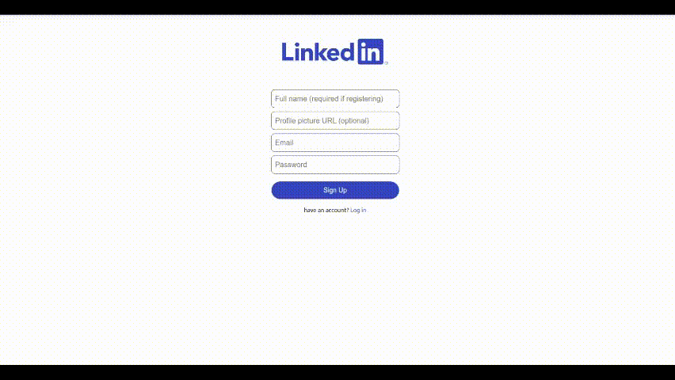

This project was bootstrapped with [Create React App](https://github.com/facebook/create-react-app), using the [Redux](https://redux.js.org/) and [Redux Toolkit](https://redux-toolkit.js.org/) template.

this is a very basic linkedin clone  you can view the [Demo here](https://linkedin-clone-7786b.web.app/)

# TODO

1. [X] Setup the project and Firebase 
2. [X] build the header
3. [X] build the sidebar
4. [X] build the feed section
    1.  [X] build the feed sections and view posts from local
    2. [X] build the feed form and add posts to loacl
    3. [X] add animations with posts
    4. [X] get and add posts with firebase 
    5. [X] add skeleton loader
5. [X] the widget section
6. [X] authentication
    1. [X] create login page
    2. [X] create signup page
    3. [X] add redux slice for users
    4. [X] make animation in the auth page
    5. [X] authenticate with firebase
    6. [X] allow for user to be always signed in
    7. [X] add drop down menu to log out
7. [X] deploy 
8. [X] update the readme and add gif for the project

## Available Scripts

In the project directory, you can run:

### `npm start`

Runs the app in the development mode. 
Open [http://localhost:3000](http://localhost:3000) to view it in the browser.

The page will reload if you make edits. 
You will also see any lint errors in the console.

### `npm run build`

Builds the app for production to the `build` folder. 
It correctly bundles React in production mode and optimizes the build for the best performance.

The build is minified and the filenames include the hashes. 
Your app is ready to be deployed!

See the section about [deployment](https://facebook.github.io/create-react-app/docs/deployment) for more information.

